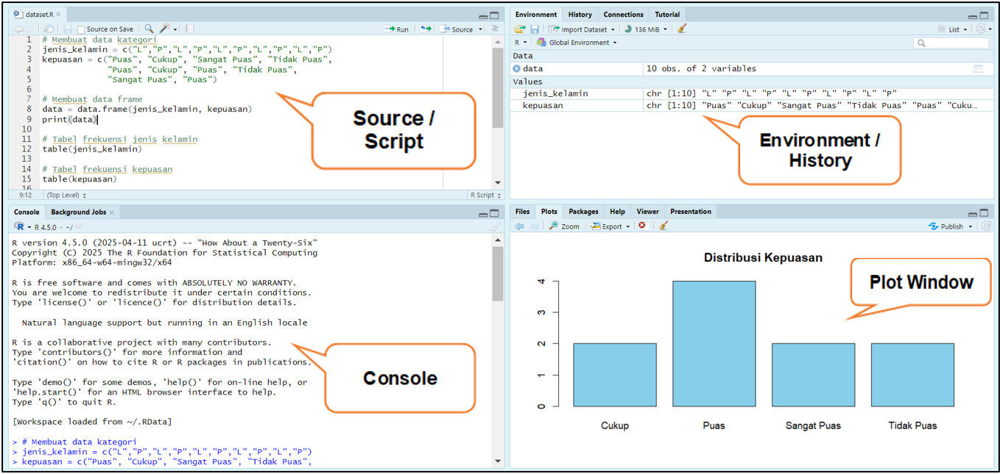

::: {.callout-important icon="false"}
## 1.1 Tujuan

-   Menjelaskan perbedaan data kategori (nominal & ordinal) dengan data numerik.
-   Menginput dataset kategori sederhana ke dalam R.
-   Mengelola data kategori menggunakan **factor**.
-   Membuat tabel frekuensi, proporsi, tabel silang, dan visualisasi sederhana.
-   Menafsirkan hasil analisis deskriptif awal.
:::

## 1.1. Pendahuluan & Konsep Dasar

**A. Latar Belakang**

Data dalam penelitian dapat dibedakan menjadi **data kuantitatif** (numerik) dan **data kualitatif** (kategori). Fokus dalam praktikum ini adalah **data kategori**, yaitu data yang merepresentasikan atribut, label, atau klasifikasi, bukan angka yang bisa dioperasikan secara matematis.

Data kategori berbeda dengan data numerik. Data numerik memungkinkan operasi aritmatika (penjumlahan, rata-rata, dsb.), sedangkan data kategori lebih banyak dianalisis dengan **proporsi, frekuensi, tabel kontingensi, uji Chi-Square, dan ukuran asosiasi.**

**B. Jenis Data Kategori**

1.  **Nominal** → menunjukkan label atau kategori tanpa urutan

    Contoh:

    -   Jenis kelamin = {Laki-laki, Perempuan},
    -   Warna baju = {Merah, Biru, Hijau},
    -   Golongan darah = {A, B, AB, O}

    Karakteristik: tidak ada peringkat, hanya pembeda kelompok.

2.  **Ordinal** → menunjukkan kategori dengan urutan, tetapi jarak antar kategori tidak terdifinisi secara kuantitatif.

    Contoh:

    -   Tingkat pendidikan = {SD, SMP, SMA, Peruguran Tinggi}
    -   Tingkat kepuasan = {Tidak Puas \< Cukup \< Puas \< Sangat Puas}

    Karakteristik: ada peringkat, tetapi tidak bisa dilakukan operasi aritmetika

**C. Perbedaan Data Kategori vs Data Numerik**

Tabel 1.1 Perbandingan Data Kategori vs Data Numerik

| **Aspek** | Data Kategori | Data Numerik |
|------------------|-----------------------------|-------------------------|
| Nilai | Kategori (label, simbol, kode) | Angka hasil pengukuran |
| Operasi Matematika | Tidak bisa (hanya hitung frekuensi) | Bisa (penjumlahan, rata-rata, dsb.) |
| Contoh Analisis | Tabel kontingensi, Chi-Square, ukuran asosiasi | Rata-rata, varians, korelasi, regresi |
| Contoh Variabel | Jenis kelamin, warna, jurusan | Tinggi badan, berat badan, |

**D. Contoh Dataset Praktikum**

Contoh dataset sederhana: preferensi minuman mahasiswa

Tabel 1.2 Data Preferensi Minuman dan Kepuasan Mahasiswa

| ID  | Jenis Kelamin | Minuman Favorit | Tingkat Kepuasan |
|-----|---------------|-----------------|------------------|
| 1   | L             | Teh             | Puas             |
| 2   | P             | Kopi            | Sangat Puas      |
| 3   | L             | Susu            | Cukup            |
| 4   | L             | Kopi            | Puas             |
| 5   | P             | Teh             | Tidak Puas       |

Jenis Data:

-   Variabel **Jenis Kelamin** → Nominal
-   Variabel **Minuman Favorit** → Nominal
-   Variabel **Tingkat Kepuasan** → Ordinal

## 1.2 Pengenalan R untuk Praktikum

**A. Instalasi R dan RStudio**

Langkah instalasi R:

1.  Unduh R dari situs resmi: <https://cran.r-project.org>
2.  Pilih sesuai sistem operasi (Windows, Mac)
3.  Ikuti wizard instalasi standar

Langkah instalasi RStudio (IDE):

1.  Unduh RStudio Desktip (versi gratis) dari [https://posit.co/download/ rstudio-desktop/](https://posit.co/download/%20rstudio-desktop/)
2.  Install seperti aplikasi biasa
3.  Jalankan RStudio, otomatis akan terhubung dengan R yang sudah terinstal.

**B. Antarmuka RStudio**

RStudio memiliki empat panel utama:

1.  **Source / Script Editor** (kiri atas) → tempat menulis kode.
2.  **Console** (kiri bawah) → tempat menjalankan perintah langsung.
3.  **Environment/History** (kanan atas) → menampilkan variabel & history perintah.
4.  **Files/Plots/Packages/Help** (kanan bawah) → akses file, visualisasi grafik, paket, dokumentasi.



|  |
|------------------------------------------------------------------------|
| **Tips:** Biasakan menulis kode di script (Ctrl+Shift+N) lalu jalankan baris per baris (Ctrl+Enter). |

**C. Perintah Dasar R**

Beberapa perintah penting untuk memulai:

```{r}
# Operasi sederhana

2 + 3       # Penjumlahan
5 * 4       # Perkalian
10 / 2      # Pembagian

# Membuat variabel
x <- 10
y <- "Mahasiswa"
z <- c(1, 2, 3, 4, 5)   # Membuat vektor
```

Keterangan:

-   `<-` adalah operator assignment (bisa juga pakai `=`)
-   `c()` digunakan untuk membuat vektor

**D. Struktur Dasar R untuk Analisis Kategori**

Analisis data kategori banyak menggunakan struktur:

1.  **Vektor** → kumpulan nilai satu dimensi.

    ```{r}
    gender <- c("L", "P", "L", "P", "L")
    ```

2.  **Factor →** vektor khusus untuk data kategori.

    ```{r}
    kepuasan <- factor(c("Puas", "Sangat Puas", "Cukup", "Tidak Puas"))
    ```

3.  **Data Frame** → tabel data (baris = observasi, kolom = variabel).

    ```{r}
    data <- data.frame(
      ID = 1:5,
      Gender = c("L", "P", "L", "L", "P"),
      Minuman = c("Teh", "Kopi", "Susu", "Teh", "Kopi"),
      Kepuasan = c("Puas", "Sangat Puas", "Cukup", "Tidak Puas", "Cukup")
    )
    ```
